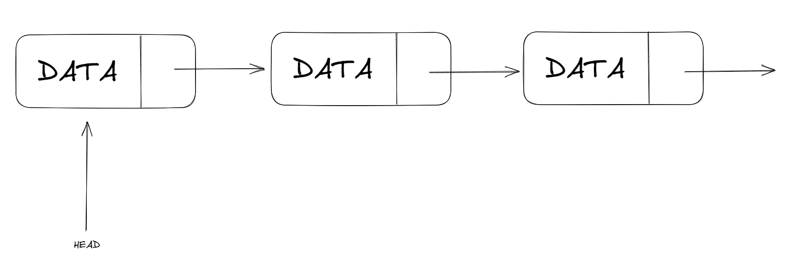

# Linked List

## What is a linked list

A Linked List is a linear data structure as an array, but it is not allocated in an contiguous block of memory. Each **NODE** of the **Linked List** has an value which can be an **int**, **float**, **char**, **string** and a reference (link) to the next **NODE** in the **Linked List**.  
The most common way to implement a Linked List is initializing a head pointer which points to the firts element of the list and since that element we can traverse the **Linked List** and reach any element in it.



## Advantages of Linked List over arrays

- Ease of Insertion/Deletion;
- Insertion at the beginning (and sometimes at the end if we use a tail pointer) is a constant time operation and takes O(1) time, as compared to arrays where inserting an element at the beginning takes O(n) time, where n in the number of elements in the array. 

## Drawbacks of Linked Lists:

-   To acces an element we have to traverse the list since **HEAD** or **TAIL**;
-   Extra memory space for a pointer is required with each element of the list;
-   Not cache-friendly. Since array elements are contiguous locations, there is the locality of reference which is not there in the case of linked lists;
-   It takes a lot of time in traversing and changing the pointers;
-   Reverse traversing is not possible in singly linked lists;
-   It will be confusing when we work with pointers;
-   Searching for an element is costly and requires O(n) time complexity;
-   Sorting of linked lists is very complex and costly;
-   Appending an element to a linked list is a costly operation, and takes O(n) time, where n is the number of elements in the linked list, as compared to arrays that take O(1) time.

## Linked List Implementation

This is a basic implementation in Python

```python
class Node:
    def __init__(self, data):
        self.data = data
        self.next = None

class LinkedList:
    def __init__(self, data: int):
        self.head = Node(data)
        self.len = 1

    def create(self, data):
        node = Node(data)
        self.head = node
        self.len += 1

    def append(self, data):
        node = Node(data)
        temp = self.head
        while (temp.next != None):
            temp = temp.next
        temp.next = node
        self.len += 1

    def prepend(self, data):
        node = Node(data)
        node.next = self.head
        self.head = node
        self.len += 1

    def deleteAt(self, index):
        ...

    def __len__(self):
        return self.len

if __name__ == "__main__":
    ll = LinkedList(1)

```