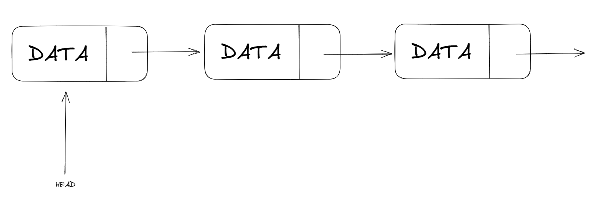

# Lista Ligada

## O que é uma Lista Ligada?

Uma lista ligada é uma estrutura de dados linear como um vetor, mas os elementos da lista ligada não são alocados em um bloco contínuo de memória. Cada **NÓ** da **Lista Ligada** tem um valor que pode ser de qualquer tipo (teoricamente) e também uma referência, que funciona como um link para o próximo **NÓ** da lista.  
A forma mais comum de se implementar uma Lista Ligada é inicializar um apontador para o primeiro item da lista e a partir deste conseguimos passar por todos elementos da lista, se necessário, através do **LINK** para os próximos elementos.  
Existe dois tipos de listas ligadas, as unicamente ligadas e as duplamente ligadas. As unicamente ligadas tem apenas um ponteiro para o próximo elemento na lista enquanto a duplamente ligada tem um ponteiro para o próximo elemento e também para o anterios.

## Vantagens da lista ligada sobre o vetor

- Facilidade na inserção e ao apagar;
- Inserir no início (e algumas vezes ao final se utilizarmos também um apontador para o último elemento da lista) é uma operação constante, ou seja, tem O(1), o que é vantajoso comparado à mesma operação em um vetor que leva tempo linear, ou seja, O(n), onde n é o número de elementos no vetor.

## Desvantagens da Lista Ligada

- Para acessar um elemento no meio da lista é necessário passar por todos os elementos até ele partindo do primeiro ou do último elemento (caso tenhamos um **HEAD** e um **TAIL** e também que seja duplamente ligada);
- É necessário memória extra para alocar os ponteiros de cada elemento da lista;
- Caminhar pela lista e trocar os ponteiros leva bastante tempo, relativemente;
- Não é possível caminhar pela lista ao contrário em uma lista unicamente ligada;
- É confuso trabalhar com ponteiros;
- Procurar por um elemento tem sempre tempo linear, ou seja, O(n);
- Ordenar uma lista ligada é muito complexo e custoso;